# 15 basic Git command

## Commands----

1) Git Init- 
•	The git init command creates a new Git repository. 
•	Git init is one way to start a new project with Git. 
•	To initialize a repository, Git creates a hidden directory called (.git)
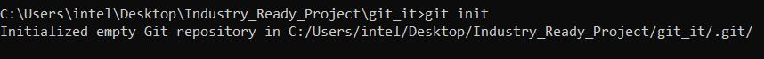 

###############################################################################################################################################################

2) Git Clone- 
•	git clone is primarily used to point to an existing repo and make a clone or copy of that repo at in a new directory, at another location. 
•	The git clone command copies an existing Git repository. 
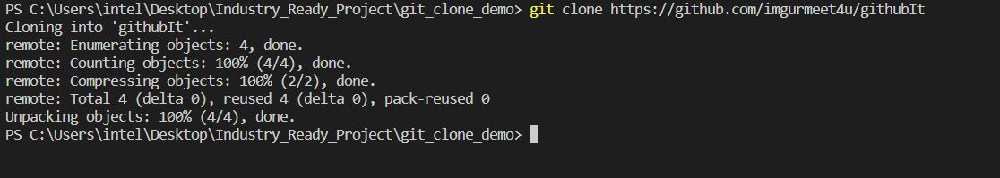 

###############################################################################################################################################################

3)	Git Status- 
•	The git status command displays the state of the working directory and the staging area. 
•	Git staus lets you see which changes have been staged, which haven't, and which files aren't being tracked by Git. 
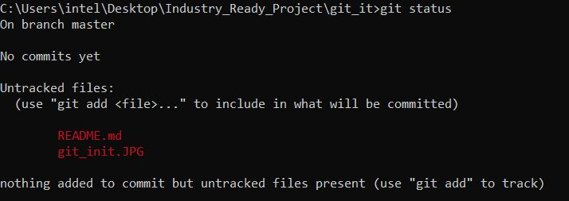 

###############################################################################################################################################################

4) Git add- 
•	The git add command adds a change in the working directory to the staging area. 
•	Git add tells Git that you want to include updates to a particular file in the next commit.  
•	Git add doesn't really affect the repository in any significant way—changes are not actually recorded until you run git commit.  
•	Basic way to write the git add command are – a) git add . (where . signifies changes in the multiple files done) b) git add <filename> (If you want to git add particular file )  
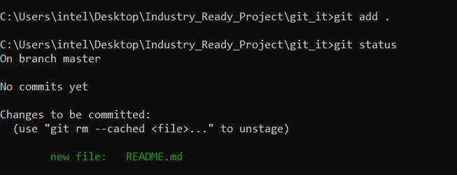 

###############################################################################################################################################################

5)	Git branch- 
•	A branch in Git is simply a lightweight movable pointer to one of these commits. 
•	Git branch can give you the list of branches exists and in which branch you are currently working. 
#### redirecting to main branch and by using *git branch* checking the list of branches. 
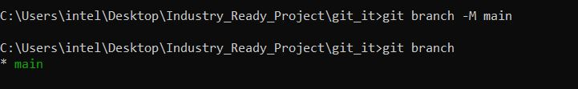 
#### creating new branch 
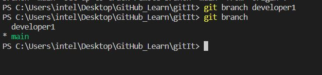 

###############################################################################################################################################################

6)	Git checkout- 
•	The git checkout command lets you navigate between the branches created by git branch . 
•	Checking out a branch updates the files in the working directory to match the version stored in that branch, and it tells Git to record all new commits on that         branch. 
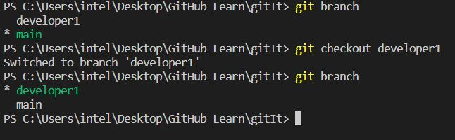 

###############################################################################################################################################################

7)	Git pull- 
•	The git pull command is used to fetch and download content from a remote repository and immediately update the local repository to match that content. 
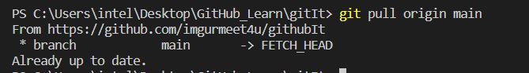 

###############################################################################################################################################################

8)	Git revert- 
•	The git revert command is a forward-moving undo operation that offers a safe method of undoing changes.  
•	Instead of deleting or orphaning commits in the commit history, a revert will create a new commit that inverses the changes specified.  
•	Git revert is a safer alternative to git reset in regards to losing work. 
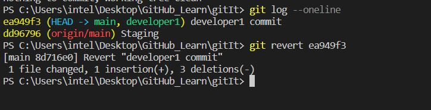 

###############################################################################################################################################################

9)	Git config –global- 
•	To set your Git username 
•	Git username does not need to be the same as your version control username, such as the one you use on GitHub. 
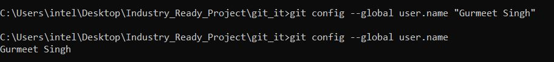 

###############################################################################################################################################################

10)	Git log- 
•	Git log is a utility tool to review and read a history of everything that happens to a repository. 
•	Multiple options can be used with a git log to make history more specific. 
•	Generally, the git log is a record of commits. 
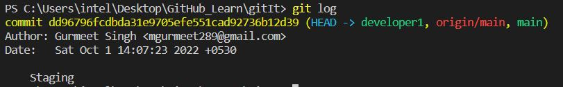 

###############################################################################################################################################################

## Stash change 

11)	Git stash- 
•	Git stash is a built-in command with the distributed Version control tool in Git that locally stores all the most recent changes in a workspace and resets the state   of the workspace to the prior commit state.  
•	A user can retrieve all files put into the stash with the git stash pop and git stash apply commands. 
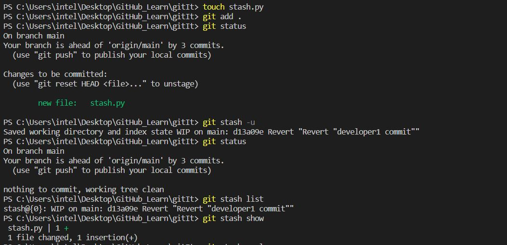 

###############################################################################################################################################################

12)	Git push- 
•	The git push command is used to upload local repository content to a remote repository. 
•	Git Push Origin pushes all the branches to the main branch. 
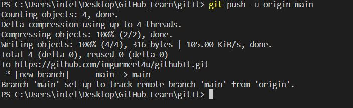 

###############################################################################################################################################################

13)	Git fetch- 
•	Git fetch is a primary command used to download contents from a remote repository. 
•	Git fetch is the command that tells the local repository that there are changes available in the remote repository without bringing the changes into the local         repository.  
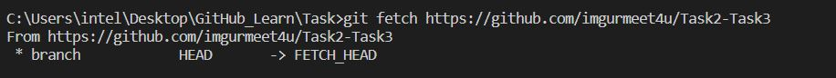 

###############################################################################################################################################################

14)	Git Rebase- 
•	Git Rebase is the process of moving or combining a sequence of commits to a new base commit. 
•	Git merge is a command that allows you to merge branches from Git whereas Git rebase is a command that allows developers to integrate changes from one branch to       another. 
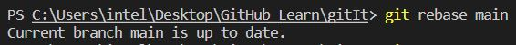 

###############################################################################################################################################################

15)	Git show- 
• Git show is a command line utility that is used to view expanded details on Git objects such as blobs, trees, tags, and commits. 
• Git show command is similar to git log in terms of output. Git show also presents you the output in the same format as we studied in the git log tutorial. A slight     difference is that the git show command shows you two things: The commit to which HEAD is pointing. 
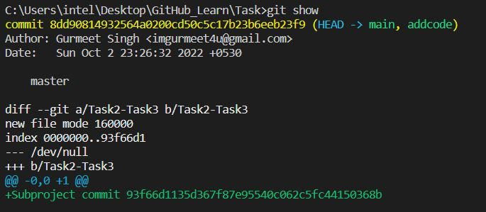 
